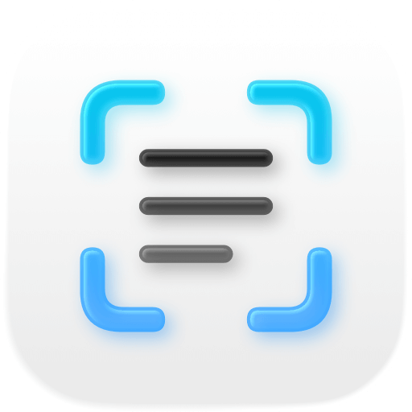
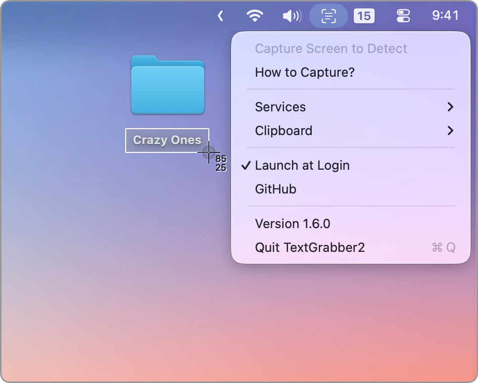
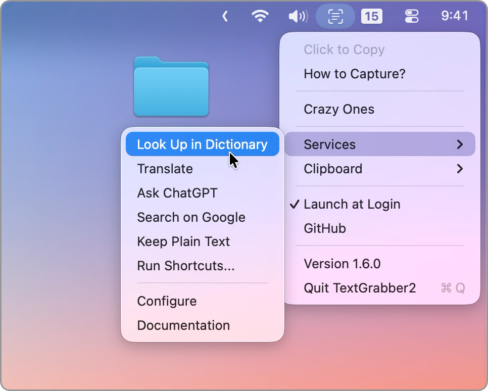

# TextGrabber2

  

TextGrabber2 is a free and **open-source** macOS menu bar app that efficiently detects text from copied images. This eliminates the need to save images as files and then delete them solely for the purpose of text detection.

 

For example, press `Control-Shift-Command-4` to capture a portion of the screen and then open TextGrabber2 from the menu bar.

It also functions effectively for any form of image copying.

> Note that keyboard shortcuts can be remapped (and it's recommended since pressing 4 keys is a bit clunky). Please check out Apple's [documentation](https://support.apple.com/guide/mac-help/mchlp2271/mac) for details.
>
> Learn more [here](https://github.com/TextGrabber2-app/TextGrabber2/wiki#capture-screen-on-mac).

> [!TIP]
> Discover our other free and open-source apps at [libremac.github.io](https://libremac.github.io/).

## Installation

Get `TextGrabber2.dmg` from the <a href="https://github.com/TextGrabber2-app/TextGrabber2/releases/latest" target="_blank">latest release</a>, open it and drag `TextGrabber2.app` to `Applications`.

> TextGrabber2 does NOT check for updates automatically. You will need to check this repository for new releases. However, it's worth noting that updates will likely be infrequent, typically limited to bug fixes.

## Why TextGrabber2

TextGrabber2 is NOT a screenshot tool, meaning it doesn't require access like `Screen Recording` or `Accessibility`. It relies on the keyboard shortcuts you use daily.

TextGrabber2 utilizes the built-in [Vision](https://developer.apple.com/documentation/vision/) framework, which is on-device, secure, fast, accurate, and **free**. In fact, it's often superior to many paid services.

TextGrabber2 connects to [system services](https://github.com/TextGrabber2-app/TextGrabber2/wiki#connect-to-system-services), you can easily integrate your workflows.

TextGrabber2 does NOT have any settings; it works magically until something goes wrong.

It's simple, privacy-oriented, brutal and beautiful.

## Where is TextGrabber1

TextGrabber1 does not exist; the "2" in TextGrabber2 does not indicate a version number.

Here's the thing, there was a discontinued app called TextGrabber that I used a decade ago, I quite liked it.

When initiating this project, I couldn't think of a better name than TextGrabber, so I decided to name it:

**TextGrabber** *"too"*.
